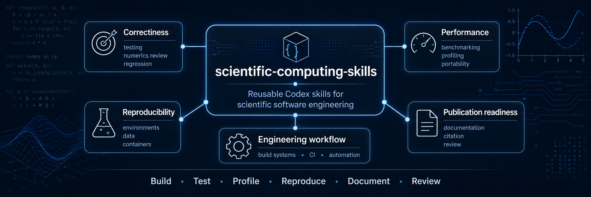

# Scientific Computing Skills



[](https://doi.org/10.5281/zenodo.20723946)

`scientific-computing-skills` is a Codex plugin distribution for reusable
scientific-software engineering workflows. It packages focused skills for
building, testing, profiling, benchmarking, documenting, and reviewing
scientific and HPC-oriented codebases.

The package intentionally excludes site-specific HPC operations such as cluster
login setup, Slurm account handling, site filesystems, and probe submission
workflows. Those belong in a separate HPC operations skill package.

## Included Skills

- `scientific-accelerator-portability`: GPU and accelerator portability across
  CUDA, HIP, SYCL, OpenACC, Kokkos, OpenMP offload, hardware generations,
  drivers, compilers, and fallback paths.
- `scientific-build-systems`: build-system configuration, compiler warnings,
  build types, sanitizers, dependencies, and portable CMake-style workflows.
- `scientific-ci`: CI design for scientific projects, including compiler
  coverage, numerical validation, artifacts, and cost-aware matrices.
- `scientific-cli-benchmark`: repeatable command-line benchmarking for serial,
  threaded, and HPC workloads.
- `scientific-cli-design`: batch-friendly command-line interfaces,
  configuration behavior, validation, logging, and output conventions.
- `scientific-code-style`: reusable coding and validation defaults for
  scientific-computing repositories when project guidance is minimal.
- `scientific-container-workflows`: Apptainer-first scientific container
  workflows, with Docker or Podman as local options and HPCCM recipes as the
  preferred source of truth for non-trivial definition files.
- `scientific-data-analysis-and-visualization`: language-agnostic guidance for
  defensible scientific analysis, figures, tables, summaries, uncertainty,
  comparisons, and reproducible analysis artifacts.
- `scientific-data-management`: scientific data boundaries, reference
  fixtures, generated outputs, checksums, provenance, large artifacts, Git
  hygiene, and optional DVC usage.
- `scientific-documentation`: user and developer documentation for algorithms,
  assumptions, parameters, workflows, reproducibility, and performance context.
- `scientific-io-and-data-formats`: scientific file layout, metadata,
  checkpointing, portability, reproducibility, and I/O performance tradeoffs.
- `scientific-numerics-review`: numerical stability, conditioning,
  convergence, tolerances, invariants, and scientific correctness risks.
- `scientific-notebook-workflows`: reproducible scientific notebook workflows,
  including output policy, CI smoke checks, reusable logic, and intentional
  report/demo notebooks with committed outputs.
- `scientific-package-management`: Python-first scientific package layout and
  environment management, with lighter guidance for R and Julia projects.
- `scientific-parallel-debugging`: debugging races, deadlocks,
  nondeterminism, halo exchange, load imbalance, and serial/parallel drift.
- `scientific-performance-portability`: preserving performance across
  compilers, CPUs, node layouts, and cluster environments.
- `scientific-profiling`: profiling CPU, memory, cache, synchronization,
  vectorization, scaling, and Python/native numerical workloads.
- `scientific-release-and-publication`: public release preparation, versioning,
  citation metadata, DOI workflows, release notes, artifact hygiene, and
  publication-ready repository checks.
- `scientific-reproducibility`: capturing seeds, environments, toolchains,
  inputs, configs, and run metadata needed for repeatable results.
- `scientific-review`: broad scientific-code and repository review for
  correctness, validation, reproducibility, performance, documentation, and
  release-readiness risks.
- `scientific-testing`: numerical, stochastic, regression, and
  parallel-consistency tests for scientific software.
- `scientific-workflow-automation`: Nextflow-first workflow automation for
  reproducible multi-step scientific pipelines that should scale from laptops
  to HPC clusters or cloud executors.

## Support Skills

- `developer-tool-installation-policy`: use when deciding whether tools such as
  `ruff`, `dvc`, `hpccm`, `pre-commit`, `nextflow`, or `quarto` belong in
  project-local environments, CI/pre-commit configuration, or isolated global
  installs.
- `git-refactor-hygiene`: use when scientific-computing work involves moving,
  renaming, staging, committing, or preparing pull requests so Git history,
  branch scope, atomic commits, and staging stay clean.
- `project-repository-setup`: use when scientific-computing work needs a sane
  repository baseline, including layout, root-file hygiene, local validation
  commands, pre-commit hooks, CI alignment, and root `AGENTS.md` guidance that
  points future agents at the scientific skill set.

## Skill Boundary Guide

See `ROUTING.md` for the full skill-selection guide.

Use `scientific-accelerator-portability` when GPU or accelerator code must stay
correct and maintainable across backends, hardware generations, drivers,
compilers, and fallback paths.
Use `developer-tool-installation-policy` when choosing whether reusable tools
such as `ruff`, `dvc`, `hpccm`, `pre-commit`, `nextflow`, or `quarto` should be
project-pinned or installed as isolated global CLIs.
Use `scientific-testing` for correctness tests and regression protection.
Use `scientific-cli-benchmark` for measured runtime comparisons.
Use `project-repository-setup` for baseline local hooks, repository layout, root
`AGENTS.md` guidance, branch/commit hygiene expectations, and local command
entry points. Use `scientific-ci` for CI job design and GitHub Actions workflow
details.
Use `scientific-profiling` when benchmark results need root-cause diagnosis.
Use `scientific-data-analysis-and-visualization` when scientific outputs need
defensible figures, tables, summaries, uncertainty handling, or comparison
reports.
Use `scientific-data-management` when raw data, processed data, fixtures,
generated outputs, large artifacts, checksums, or DVC boundaries need to be
made explicit.
Use `scientific-numerics-review` for mathematical and floating-point risks.
Use `scientific-notebook-workflows` when notebooks need reproducibility,
reviewable output policy, CI smoke checks, or intentional report/demo outputs.
Use `scientific-performance-portability` when an optimization must generalize
beyond one machine or compiler.
Use `scientific-release-and-publication` when a repository is being prepared
for public release, citation, archival, or DOI-backed reuse.
Use `scientific-reproducibility` when results need to be rerunnable and
auditable.
Use `scientific-review` for broad scientific repository or pull-request
reviews. Use `scientific-numerics-review` for deeper numerical stability,
convergence, and tolerance concerns.
Use `scientific-container-workflows` when a scientific runtime needs portable
container recipes, especially for Apptainer/Singularity on HPC systems.
Use `scientific-workflow-automation` when ad hoc shell steps should become a
version-controlled workflow, with Nextflow as the preferred default for
multi-step pipelines.

## Layout

```text
scientific-computing-skills/
  .codex-plugin/plugin.json
  skills/
    git-refactor-hygiene/
      SKILL.md
    project-repository-setup/
      SKILL.md
    scientific-*/
      SKILL.md
```

## Development

Use the project repository checkout (for example
`~/Projects/scientific-computing-skills`) for active development on short-lived
feature branches based on the repository's intended integration branch. This
repository currently uses `development` for that role; other projects may use
`main`, `trunk`, or release branches. Before implementing a new fix, feature,
refactor, or documentation concern, inspect the current branch and create a
focused branch from the actual pull-request target. Keep each branch and pull
request to one concern so it can be reviewed, reverted, or released
independently.

If work starts to drift from the branch's stated intent, stop and split the
scope: either stay focused on the current concern or move the new concern to a
separate branch. Make skill, metadata, and documentation changes in the
development checkout for this repository, then run the validation commands
before merging or publishing.

Treat `~/plugins/scientific-computing-skills` as the local Codex plugin
installation checkout. Keep it on `main` for normal use, update it from the
released or merged state, refresh the plugin cachebuster when needed, and then
reinstall from the personal marketplace.

Installing from a feature branch in `~/plugins/scientific-computing-skills` is
useful only for intentional testing of unreleased skill behavior. Switch that
checkout back to `main` after the test so new Codex sessions do not load
unfinished changes accidentally.

## Installation

Clone the plugin into the standard local plugin directory:

```bash
mkdir -p ~/plugins
git clone https://github.com/gjbex/scientific-computing-skills.git \
  ~/plugins/scientific-computing-skills
```

If `~/plugins/scientific-computing-skills` already exists, inspect it before
installing. A valid checkout should contain `.git`, `.codex-plugin/plugin.json`,
and `skills/`:

```bash
find ~/plugins/scientific-computing-skills -maxdepth 2 -type f -print
```

If it is already a Git checkout, update it instead of cloning:

```bash
git -C ~/plugins/scientific-computing-skills pull --ff-only
```

If it is an old scaffold with only `.codex-plugin/plugin.json`, move it aside
before cloning the real repository:

```bash
mv ~/plugins/scientific-computing-skills \
  ~/plugins/scientific-computing-skills.scaffold-backup-$(date -u +%Y%m%dT%H%M%SZ)

git clone https://github.com/gjbex/scientific-computing-skills.git \
  ~/plugins/scientific-computing-skills
```

Install or reinstall the plugin from the personal marketplace:

```bash
codex plugin add scientific-computing-skills@personal
```

Verify the installed source contains the bundled skills:

```bash
codex plugin list
test -f ~/plugins/scientific-computing-skills/skills/git-refactor-hygiene/SKILL.md
```

Start a new Codex thread after installation so the newly installed skills are
available in the session.

Do not run `create_basic_plugin.py --force` against this repository. That helper
is for creating a new plugin scaffold, and can overwrite a real checkout with an
empty scaffold.

## Updating

Update the local checkout, refresh the plugin version cachebuster, and reinstall
from the personal marketplace:

```bash
git -C ~/plugins/scientific-computing-skills pull --ff-only

python3 ~/.codex/skills/.system/plugin-creator/scripts/update_plugin_cachebuster.py \
  ~/plugins/scientific-computing-skills

codex plugin add scientific-computing-skills@personal
```

Start a new Codex thread after reinstalling.

## Release Metadata

Update the plugin and citation release metadata together:

```bash
python3 tools/bump_version.py 0.2.0 --date 2026-06-17
```

The plugin validator checks that `.codex-plugin/plugin.json` and `CITATION.cff`
use the same version.

## Validation

Validate the plugin manifest with:

```bash
python3 tools/validate_plugin.py .
```

Validate bundled skills with:

```bash
python3 tools/validate_skills.py skills
```

Compile bundled Python scripts:

```bash
python3 -m py_compile skills/scientific-cli-benchmark/scripts/simple_benchmark.py tools/bump_version.py
```

See `CONTRIBUTIONS.md` for contribution scope, repository hygiene, and pull
request expectations.

## Publication Notes

This project is licensed under the Apache License, Version 2.0. Redistributed
copies and derivative distributions must preserve the license and attribution
notices required by that license, including the notices in `NOTICE` where
applicable.

If you use this project or derive work from it, please cite it using the
metadata in `CITATION.cff`.

Archived release DOI: [10.5281/zenodo.20723947](https://doi.org/10.5281/zenodo.20723947).
